<div align="center">

# Retail Tower Console

**The browser admin command center for Retail Tower OS.**

<p align="center">
  <a href="docs/product/retail-tower-console-charter.md"></a>
  <a href="README.md"></a>
  <a href=".specify/memory/constitution.md"></a>
  <a href="LICENSE"></a>
</p>

<p align="center">
  <a href="specs/001-console-foundation/plan.md"></a>
  <a href="specs/002-tooling-and-scaffold"></a>
  <a href="specs/001-console-foundation/contracts"></a>
  <a href="docs/agent-os/maestro-playbook.md"></a>
</p>

<p align="center">
  <a href=".specify/memory/constitution.md"></a>
  <a href="specs/001-console-foundation/api-readiness.md"></a>
  <a href=".specify/memory/constitution.md"></a>
  <a href=".specify/memory/constitution.md"></a>
</p>

</div>

Retail Tower Console is the planned admin web frontend for Retail Tower OS. It consumes Data-Pulse-2 OpenAPI contracts and must not own backend business logic, database schema, SQL migrations, POS terminal code, worker jobs, secrets, or deployment infrastructure.

---

## 🔗 Synchronization with Retail Tower OS

The Console is a **contract-only** admin surface — it reads catalog, inventory, and sales from
`Data-Pulse-2` and never touches ERPNext directly. Data flows **down** into management screens;
operations and settings rise **up** to Data-Pulse-2.

<p align="center">
  
</p>

```text
Retail-Tower-Console ──▶ Data-Pulse-2 ──▶ ERPNext Connector ──▶ ERPNext / Frappe
```

### Where the Console sits — full ecosystem view

The diagram below places all five Retail Tower OS repositories under a shared control-plane band.
The Console is the highlighted **admin edge node** (marked **★ THIS REPO**): a browser surface that
talks only to Data-Pulse-2, never to ERPNext directly.

<p align="center">
  
</p>

<p align="center"><sub>Live, animated 3D-styled SVG. Motion honors <code>prefers-reduced-motion</code> and degrades to a static rendering on GitHub.</sub></p>

Full detail: [docs/architecture/sync-overview.md](docs/architecture/sync-overview.md) ·
Program control plane: [Retail-Tower-Orchestrator](https://github.com/ahmed-shaaban-94/Retail-Tower-Orchestrator).

---

## Live console control map

[](docs/architecture/retail-tower-console-live-map.html)

Open the [interactive Three.js console map](docs/architecture/retail-tower-console-live-map.html) through a local static server or docs host. The map is backed by [topology JSON](docs/architecture/retail-tower-console-live-map.json), while the README stays GitHub-safe with a static SVG preview.

---

## Current implementation status

This repository is planning-first with the slice 002 frontend scaffold now merged. The Vite/React shell, package manifest, lockfile, CI workflow, and generated-client storage location exist; RF-1 through RF-7 product UI remains gated by per-slice approvals.

| Area | Status | Evidence |
| --- | --- | --- |
| Console foundation | Planned | [`specs/001-console-foundation`](specs/001-console-foundation) |
| API readiness map | Partial and explicit by route family | [`specs/001-console-foundation/api-readiness.md`](specs/001-console-foundation/api-readiness.md) |
| Tooling and scaffold | Merged slice 002 scaffold | [`package.json`](package.json) · [`specs/002-tooling-and-scaffold`](specs/002-tooling-and-scaffold) |
| Runtime application code | Placeholder shell only; no RF UI | [`src/App.tsx`](src/App.tsx) |
| Generated API client | Generated from pinned Data-Pulse-2 auth/context contracts | [`src/generated/schema.d.ts`](src/generated/schema.d.ts) · [`openapi-ts.config.ts`](openapi-ts.config.ts) |
| Backend contracts | Owned upstream by Data-Pulse-2 | [`specs/001-console-foundation/contracts`](specs/001-console-foundation/contracts) |
| POS terminal behavior | Owned by POS-Pulse | [Constitution](.specify/memory/constitution.md) |

---

## What you can verify today

| Claim | Repo-backed evidence |
| --- | --- |
| The console is frontend-only | [Constitution principle 1](.specify/memory/constitution.md) |
| Data-Pulse-2 owns backend contracts | [Constitution principle 2](.specify/memory/constitution.md) · [contract boundary docs](specs/001-console-foundation/contracts) |
| POS-Pulse owns terminal behavior | [Constitution principle 3](.specify/memory/constitution.md) |
| RF UI implementation is gated | [Foundation plan](specs/001-console-foundation/plan.md) · [Maestro playbook](docs/agent-os/maestro-playbook.md) |
| Package, lockfile, dependency, and CI changes remain approval-gated | [Constitution principle 9](.specify/memory/constitution.md) |
| No secrets or deployment assumptions belong here | [Constitution principle 10](.specify/memory/constitution.md) |

---

## Planned console surface

| Route family | Scope | Posture |
| --- | --- | --- |
| RF-1 | Auth shell and active context | First implementation family after gates clear |
| RF-2 | Tenant and store management | Depends on upstream API readiness |
| RF-3 | Catalog management | Depends on Data-Pulse-2 contract coverage |
| RF-4a | Unknown items review UI | Read/write console workflow, POS behavior remains indirect |
| RF-5 | Operator/admin management | A1-A5 identity and membership surfaces |
| RF-6 | Audit and operational search | Backend-authorized read surface |
| RF-7 | Settings/system management | Depends on Data-Pulse-2 contract coverage |

---

## Repository map

| Path | Purpose |
| --- | --- |
| `specs/001-console-foundation` | Foundation spec, plan, API readiness, read-side model, and contract-consumption boundaries |
| `specs/002-tooling-and-scaffold` | Merged scaffold/tooling slice and its gate record |
| `src` | Placeholder SPA shell and generated-client storage location |
| `tests` | Slice 002 smoke tests for the scaffold |
| `docs/agent-os` | Agent OS workflow and gate discipline |
| `docs/product` | Product brief and console positioning |
| `.specify/memory/constitution.md` | Binding project boundary and implementation rules |
| `docs/architecture` | Live control map and topology data |
| `docs/assets/architecture` | GitHub-safe architecture preview assets |

### What this repo owns

Admin web frontend planning, browser UX boundaries, frontend route-family sequencing, generated API client consumption policy, and console product positioning.

### What this repo does not own

Backend APIs, OpenAPI source contracts, database schema, SQL migrations, POS terminal code, worker jobs, secrets, or deployment infrastructure. Package, lockfile, dependency, and CI changes are owned only inside explicitly approved slices.

---

## Getting started

The scaffold exists, but product UI is still gate-governed. This repo uses **pnpm** (`pnpm@9.15.0`, Node `>=22`). Start with the local state and scaffold checks:

```bash
pnpm install        # install dependencies
pnpm dev            # run the Vite dev server
pnpm build          # type-check (tsc --noEmit) + production build
pnpm lint           # Biome check
pnpm test           # Vitest run with coverage
pnpm test:e2e       # Playwright end-to-end tests
pnpm generate:client # regenerate the typed client from pinned contracts
```

Then review:

| Need | Read |
| --- | --- |
| Product scope | [`docs/product`](docs/product) |
| Governance | [Constitution](.specify/memory/constitution.md) |
| Foundation plan | [`specs/001-console-foundation/plan.md`](specs/001-console-foundation/plan.md) |
| API dependency posture | [`specs/001-console-foundation/api-readiness.md`](specs/001-console-foundation/api-readiness.md) |
| Merged scaffold gate | [`specs/002-tooling-and-scaffold`](specs/002-tooling-and-scaffold) |
| Next implementation slice | [`specs/001-console-foundation/plan.md`](specs/001-console-foundation/plan.md) slice sequence |

---

## License

MIT. See [LICENSE](LICENSE).
