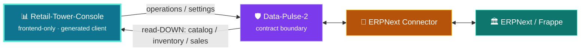

# Synchronization — Console in the Flow

> The Console is a **contract-only** admin surface. It reads from Data-Pulse-2 and never
> touches ERPNext directly.

<p align="center">
  
</p>

```text
Retail-Tower-Console ──▶ Data-Pulse-2 ──▶ ERPNext Connector ──▶ ERPNext / Frappe
```

## Two directions

| Direction | What moves | For the console |
|---|---|---|
| 🔵 **Read-DOWN** | Catalog, inventory, sales projections | Management screens render data pulled from Data-Pulse-2 contracts |
| 🟠 **Operations** | Settings, sync-ops, admin actions | Requests rise to Data-Pulse-2; never to ERPNext directly |



The Console owns **no** backend logic, schema, migrations, POS code, workers, or secrets — it
consumes Data-Pulse-2's OpenAPI contracts only.

Program-wide view: the
[Retail-Tower-Orchestrator](https://github.com/ahmed-shaaban-94/Retail-Tower-Orchestrator)
control plane.

> Architecture is stable; this document does not assert feature/merge status. See `specs/**`
> and `CLAUDE.md` for the authoritative implementation state.
